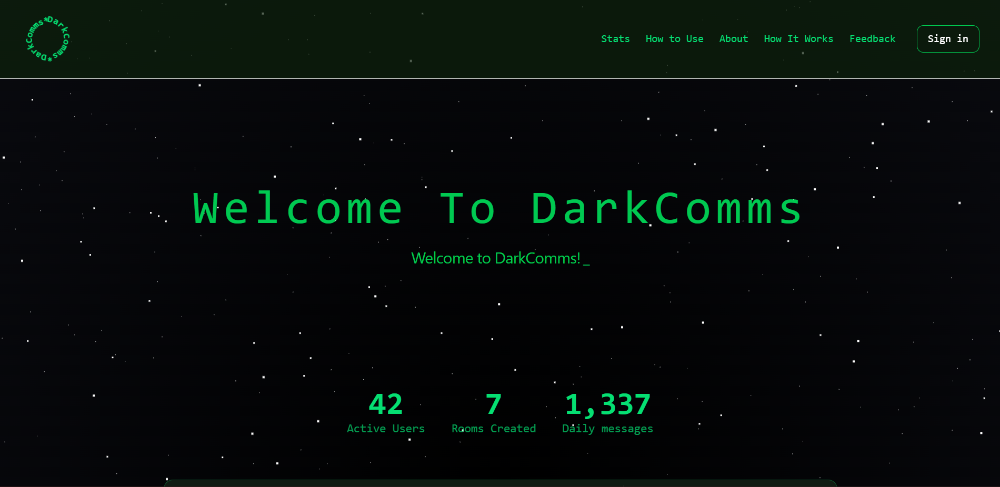
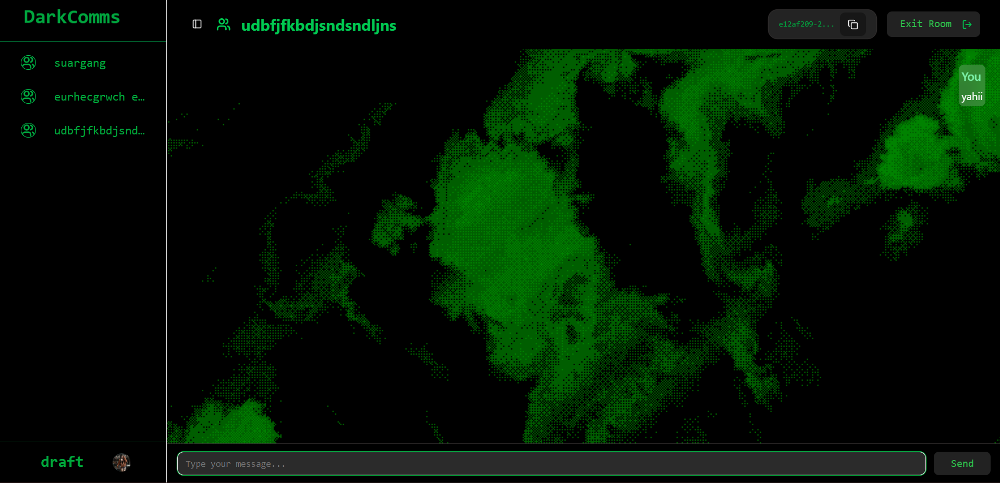
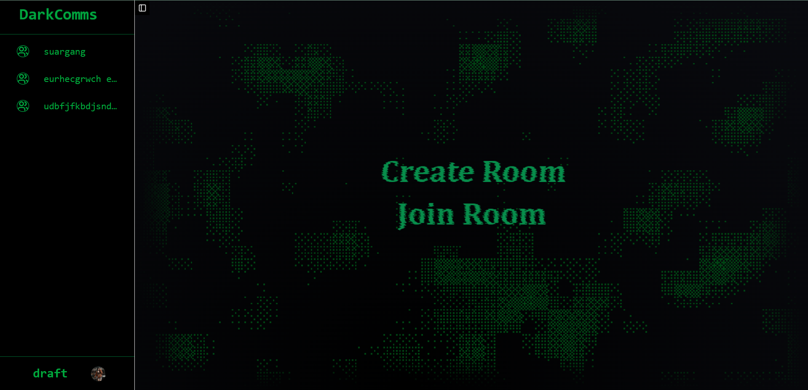

# DarkComms

**DarkComms** is a real-time chat application designed for modern web communication. It features a sleek, responsive React frontend with animations, and a robust WebSocket + Express backend for instant messaging. DarkComms is optimized for smooth user experience and scalable real-time communication.

---

## 🚀 Features

- **Real-time messaging:** Instant communication using WebSocket connections.
- **Multiple users:** Supports multiple users chatting at the same time.
- **Modern UI:** Built with [ShadCN](https://shadcn.dev/) components for a clean, professional look.
- **Animations:** Smooth UI animations using [ReactBits](https://reactbits.dev/).
- **Responsive Design:** Works on desktop and mobile devices.
- **Open for Enhancement:** Easily extendable for features like rooms, notifications, and media sharing.
- **Cross-platform Deployable:** Frontend deployable on Vercel, backend deployable on Render.

---

## Screenshots

### 1. Homepage Screen
  
This is the landing page of DarkComms, where users first arrive. It features a modern, clean UI with smooth animations powered by ReactBits. The homepage provides a brief overview of the app and directs users to login, register, or join chat rooms.

### 2. Chat Interface
  
This is the main chat interface, where users can send and receive messages in real-time. It supports multiple users simultaneously and displays messages with timestamps.

Real-time updates powered by WebSockets.

Animated message input and typing indicators using ReactBits.

Responsive design: The chat box, message list, and input adjust automatically for different screen sizes.

### 3. RoomPage Screen
  
This is the room interface, where users can either create a new room or join an existing room by entering a Room ID.

Each room acts as a separate chat space, allowing multiple rooms at the same time.

Clear UI for entering room ID, creating rooms, and navigating back to the homepage.

Responsive layout ensures buttons, input fields, and lists look consistent on mobile and desktop.

